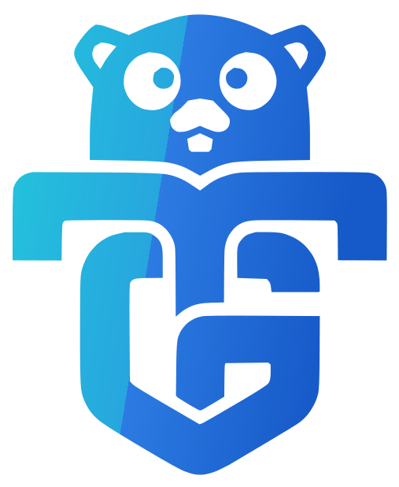

<!-- togo-header -->
<div align="center">
  
  <h1>togo-framework/validation</h1>
  <p>
    <a href="https://to-go.dev/marketplace"></a>
    <a href="https://pkg.go.dev/github.com/togo-framework/validation"></a>
    
  </p>
  <p><strong>Part of the <a href="https://to-go.dev">togo</a> framework.</strong></p>
</div>

## Install

```bash
togo install togo-framework/validation
```

<!-- /togo-header -->

<!-- togo-brand -->
<p align="center">
  
</p>
<h1 align="center">validation</h1>
<p align="center"><sub>part of the <a href="https://github.com/togo-framework">togo-framework</a> — the full-stack Go + React framework</sub></p>

Laravel-style request validation for [togo](https://github.com/togo-framework/togo).
Pure utility (no kernel dependency); generated REST handlers use it on request bodies.

```bash
togo install togo-framework/validation
```

Rules: required, email, url, uuid, min, max, len, in, numeric (nullable-aware).


---

## 💎 Premium sponsors

togo is proudly sponsored by **ID8 Media** and **One Studio**.

<p align="center">
  <a href="https://id8media.com"></a>
  &nbsp;&nbsp;&nbsp;&nbsp;&nbsp;&nbsp;
  <a href="https://one-studio.co"></a>
</p>

<!-- togo-sponsors -->
---

<div align="center">
  <h3>Premium sponsors</h3>
  <p>
    <a href="https://id8media.com"><strong>ID8 Media</strong></a> &nbsp;·&nbsp;
    <a href="https://one-studio.co"><strong>One Studio</strong></a>
  </p>
  <p><sub>Support togo — <a href="https://github.com/sponsors/fadymondy">become a sponsor</a>.</sub></p>
</div>
<!-- /togo-sponsors -->
